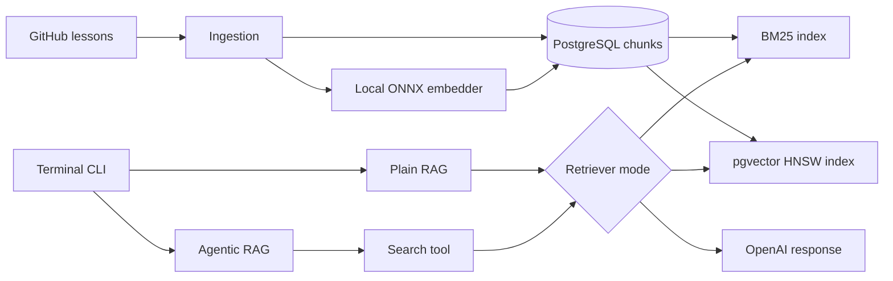

# CLI RAG

[](https://github.com/dosorio79/llm-zoomcamp/actions/workflows/cli-rag-tests.yml)

Standalone terminal RAG app based on Homework 01. It uses one PostgreSQL backend
for BM25, vector, and hybrid retrieval.

## Architecture



## Setup

Install dependencies:

```bash
uv sync
```

Create a local environment file:

```bash
cp .env.example .env
```

You can also keep a shared `.env` in the repository root or in `Lessons/.env`.
The CLI loads `cli_rag/.env` first, then falls back to `../.env` and
`../Lessons/.env` without overriding variables already exported in your shell.

Set your OpenAI API key:

```bash
OPENAI_API_KEY=your_openai_api_key_here
```

## PostgreSQL backend

The `src/db` package manages PostgreSQL connections and schema setup. The
`src/retrieval` package contains the shared retriever contract and text, vector,
and hybrid strategies. Build and start PostgreSQL 17 with `pg_textsearch` and
`pgvector`:

```bash
make db-build
make db-start
make schema-setup
make model-download
make ingest
```

The schema setup is idempotent. To recreate only the application schema:

```bash
make schema-reset
```

To remove the development container and its data volume:

```bash
make db-reset
```

Connection settings default to the values in `.env.example` and can be
overridden with `DATABASE_URL` and `DATABASE_SCHEMA`.

`make model-download` downloads the local ONNX embedding model once. Then
`make ingest` downloads the configured repository revision, creates overlapping
chunks, embeds them, and upserts them into the shared `chunks` table. Rerunning
it refreshes existing rows identified by `(filename, start)`.

## Run

Start the CLI:

```bash
make run
```

The menu provides one rebuild action for the knowledge store, plus plain
and agentic RAG entry points. Rebuilding the knowledge store drops the indexed
chunks, recreates the schema, and ingests the configured repository again.
For plain and agentic RAG, choose one retrieval mode before starting chat:

- Text / BM25: keyword-based retrieval with PostgreSQL BM25.
- Vector: semantic retrieval with local ONNX embeddings and pgvector.
- Hybrid: combines BM25 and vector rankings with rank fusion.
